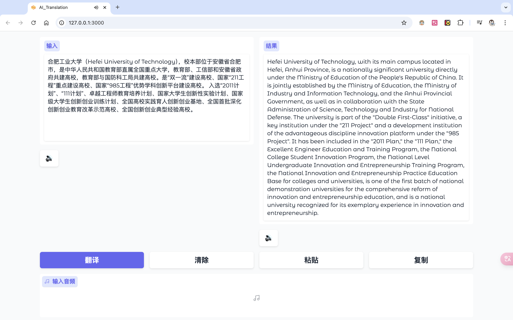
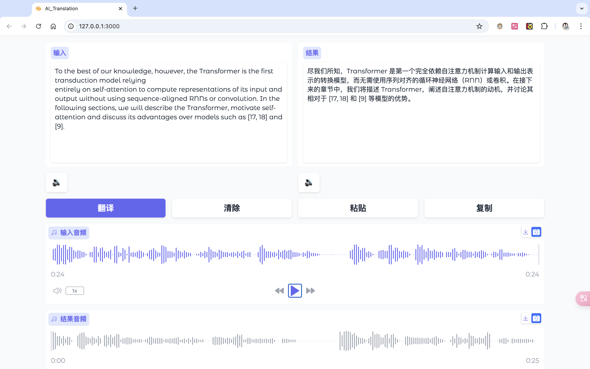

# 一个使用大语言模型翻译的简单Web程序

## 怎么来的

本项目是我在合肥工业大学 2024-2025 秋冬学期的《Python程序设计》中的大作业。灵感源自于一研究生学长在现实中遇到的问题，如果你想要更简洁的类似 Google 翻译的版本，请去原项目仓库，可以点击[这里](https://github.com/Eslzzyl/LLM-Translator)

在选题时，考虑到在我们阅读国外资料的时候，英语欠佳而被“翻译”所困扰。我使用下来，国内的一些翻译软件，处理一些基本问题时还可以，但一旦是涉及到专业的领域，学术论文和科技报告，对于专业名词的翻译一塌糊涂。而且还有“国内特色”的广告和 VIP 充值服务，使用体验令人抓狂。

如今， AI 是跨行业的火爆，爆火的大语言模型的底层技术之一“注意力机制”(Attention)是在 2017 年的经典论文《Attention is all you need》中提出来的，这篇论文中提到注意力机制最早就是用于处理机器翻译的问题的，而且在机器翻译方面表现的很好。想到这里，于是用 Python 写了一个简单的基于 OpenAI 接口的在线翻译 Web 程序。

部分界面如下图





## 项目介绍

- 该Web 程序有“通用翻译”和“学术翻译”两种模式，支持 OpenAI 的标准接口，方便我们导入 APIkey ，实现了中英文翻译的基本功能，同时支持接入 OpenAI 的语音模型进行文本转语音(Text To Speech)的功能，也支持对于 txt、docx、pdf、md 四种常用文件的支持，同时支持自定义提示词，你可以在 `prompt.py` 文件中进行自定义可以满足我们在看资料时对于翻译的大部分需求。

## 使用方法

1. 克隆项目
```
git clone https://github.com/shaneyale2005/llm_translator.git
cd llm_tranlator
```

2. 安装依赖(建议使用 conda 新建一个虚拟环境)
```
conda create -n llm_translator python=3.12 -y
conda activate llm_translator
pip install -r requirements.txt
```

3. 配置 `.env` 文件中的环境变量，接入OpenAI的接口
```
OPENAI_API_KEY=""
OPENAI_API_BASE=""
OPENAI_MODEL=""
APP_PORT=3000
```

4. 在终端中运行
```
python main.py
```

5. 接下来去本地主机的 3000 端口即可使用


